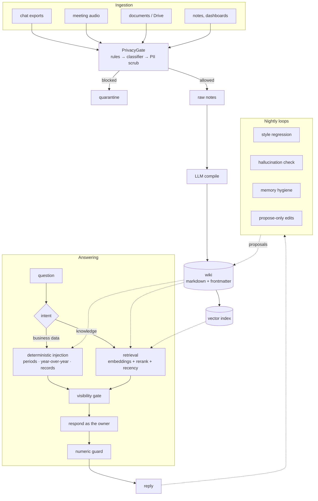

# Architecture

How the system works end to end, for someone who has not seen it before.
Roughly 103,000 lines of Python across 357 files, 180 test files, in production
since April 2026.

## 1. What problem it solves

An executive accumulates knowledge faster than they can retrieve it, and the
parts worth keeping are scattered across meetings, chat, documents, and their
own head. Generic assistants answer plausibly but not *from* that material.

This system does three things instead:

1. **Ingests** what the owner actually sees — chat exports, meeting audio,
   documents, notes, business dashboards — and compiles it into a wiki.
2. **Answers from that wiki**, grounded, with the owner's voice and judgment
   rather than a generic one.
3. **Serves two audiences from one brain**: the owner privately, and their
   organisation through a filtered public persona.

Point 3 is why so much of the code is about visibility. A single knowledge base
that answers both the owner's private questions and an employee's is only safe
if the boundary is enforced structurally, not by prompting.

## 2. The shape of it

## 3. The three things worth understanding

### 3.1 The wiki is the source of truth; the index is disposable

Knowledge lives as plain markdown with YAML frontmatter. The vector index is
derived and can be rebuilt from the markdown at any time. This is deliberate:
the substrate outlives any particular database, embedding model, or vendor.

Frontmatter carries the access decision (`clone_visibility`). A file with no
frontmatter is treated as private — the fail-safe direction is to withhold.

### 3.2 Numbers are never left to the model

Anything the model could get arithmetically wrong is computed in Python and
injected as a block the model is told to quote verbatim. Three separate
injectors exist for periods, year-over-year comparison, and records
(maximum/minimum/ranking). Retrieval is not used for these questions at all.

This was learned the hard way. Asked for a record high, an earlier version
answered with the largest value among whatever chunks the search returned. The
number was real and the answer was hedged — and still wrong, because a larger
one sat in the same file. Retrieval returns *relevant* fragments, never
*complete* sets, so any question whose correct answer requires completeness
cannot be answered by retrieval.

After the deterministic block is produced, a post-response guard re-checks the
figures in the generated text against it.

### 3.3 Privacy is enforced at several independent layers

- **Ingestion** (`privacy_gate.py`): rules first, then an LLM classifier, then
  PII scrubbing. The deterministic rules run *before* the model, which matters
  because the classifier embeds candidate text into its own prompt — the text
  can therefore try to impersonate instructions to the classifier. That defense
  cannot depend on the model being clever, so it does not.
- **Storage**: domain separation. Personal projects and deep-personal interview
  material live in paths excluded from every organisation-facing reader by a
  single predicate, so a new export path cannot forget the check.
- **Retrieval**: the index is queried with a visibility filter, and the result
  is filtered again in application code, because a metadata filter silently
  passes documents whose metadata is missing.
- **Response**: the persona prompt is scoped, and a leak detector compares
  output against known-private phrases.

Multiple layers because each one has failed at least once.

## 4. A single turn, end to end

1. Webhook receives a message; the sender determines which persona answers.
2. Intent classification routes between business data, knowledge, and
   conversation.
3. For business data, deterministic injectors resolve the period, dimension,
   and metric, and build a block of confirmed figures.
4. For knowledge, the question is embedded, the index returns candidates,
   a reranker reorders them, recency bias adjusts, and the visibility gate
   filters.
5. Context is assembled under a character budget — core persona files first,
   then injected blocks, then retrieved fragments.
6. The model responds in the owner's voice.
7. The numeric guard verifies figures; the leak detector checks for private
   phrases.

## 5. What runs on a schedule

Ingestion runs continuously (a file watcher plus periodic scrapers). Overnight,
a set of quality loops runs against the previous day: style regression against
reference answers, post-hoc verification of factual claims, memory hygiene,
usage aggregation, and an auto-improvement pass.

The auto-improvement pass is **propose-only for anything it cannot justify from
a human's words**. An earlier version was allowed to write knowledge pages from
its own answers, which meant a wrong answer became institutional knowledge
overnight. It now checks attribution: an edit grounded solely in the
assistant's own utterances is queued for review rather than applied.

## 6. Model routing

All inference goes through a gateway with named aliases (`smart`, `fast`,
`supervisor`, and so on) rather than model identifiers in code. Swapping a
model is an environment change.

Two rules matter beyond convenience. **Judges must be a different model family
than the model being judged**, or the evaluation loop grades its own homework.
And **fallbacks must terminate at a different provider**, because a provider-wide
outage makes same-provider fallback worthless — verified during a real outage.

A subtle failure this protects against: a model that rejects a parameter returns
an error, the gateway silently falls back, and everything keeps returning
success. Cost and behaviour drift with no alarm. Parameters are now normalised
per provider, and a probe checks that each alias still resolves where expected.

## 7. Operations

Single machine, Docker Compose: the application, the model gateway with its
database, Redis, and a tunnel for inbound webhooks. Scheduled work runs from
cron; things cron cannot do (anything needing a GUI session or the ability to
restart the container runtime itself) run from a supervisor at the OS level.

Self-healing is deliberately narrow: restart the application container on a
failed health check or a silent-inbound window, and restart the container
runtime if the daemon itself stops responding. Anything destructive requires a
human.

Failures are reported through an escalating notifier that suppresses repeats —
a monitor that sends the same message every day is noise, and noise is
indistinguishable from silence.

## 8. Known weak points

- **Two modules are too large.** The web layer and the knowledge layer each
  exceed 6,000 lines. New endpoints and new logic are directed elsewhere while
  they are decomposed.
- **The vector store is single-process.** It cannot be safely read by a second
  process while the application runs, which complicates auditing and rebuilds.
- **Context budget is a blunt instrument.** When the assembled context exceeds
  the limit, files are scaled down by rule; a document can lose the section that
  actually answered the question. Making that trade-off visible is open work.
- **Retrieval quality is measured, but not comprehensively.** The evaluation
  set does not yet cover every question class the system is asked in production.

## 9. Where the code lives

| Path | What it is |
|---|---|
| `main.py` | webhook server, scheduler bootstrap, file watcher |
| `brain_wiki.py` | compile, retrieval assembly, persona response |
| `brain_wiki_helpers/` | 26 pure-function modules: visibility, ontology, deterministic injectors, append guard |
| `brain_index.py` | vector index and reconciliation |
| `privacy_gate.py` | ingestion filter |
| `services/`, `routes/` | application services and API routers |
| `scripts/` | scrapers, quality loops, extractors, operational tooling |
| `tests/` | 180 files, no private data, no network, no keys |

For adapting this to another person or company, start with
[`porting/GENERIC_VS_SPECIFIC.md`](porting/GENERIC_VS_SPECIFIC.md), which
separates the reusable engine from what must be replaced.
