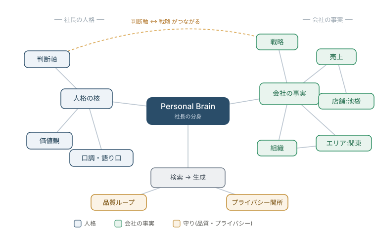
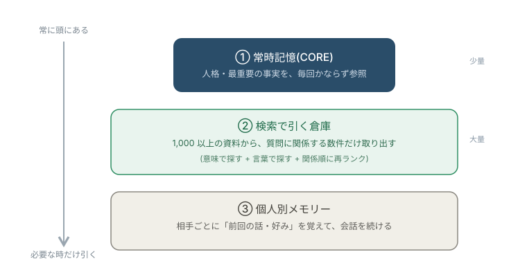

# 経営者の AI 分身を、<br>会社に置く

### Personal Brain — OWNDAYS 海山が自社で運用中

<br>

<span class="small">「自分の判断軸」と「会社の数字」を覚えた AI。<br>社員が “社長本人に聞くように” 使える仕組みの紹介。</span>

---

## 一言でいうと

# 「自分」と「会社」を<br>覚えた AI

社員がチャットで質問 → **社長の口調 × 実データ** で即答。

> 「池袋の売上は?」「この投資どう思う?」 を、<br>**社長本人に聞くように** 引ける。

---

## 解こうとしている課題

<br>

| 現実 | このシステム |
|---|---|
| 社長は全社員と毎日話せない | 判断軸が**全社に同時にスケール** |
| 数字は毎回 担当に聞く | 誰でも**いつでも事実ベース**で会話 |
| 社長の考えは“頭の中” | **システムとして残り、増えていく** |

→ **経営者の思考を、組織の共有財産にする**

---

## 何ができるか ①  ─ 数字を即答

> **社員**「池袋店の売上は?」
>
> **AI**「池袋、強い店だね。今月 客数800 / 売上1,000万 / 客単価12,500円。
> 前年比だと売上120%、客数主導で伸びてるのがいい形。」

数字を返すだけでなく **“社長の読み筋” が乗る**。

---

## 何ができるか ②③  ─ 判断・AI活用

> **社員**「この施策、ROI が読みづらくて」
> **AI**「ROI だけで判断すると必要な投資を見誤ることもある。間接的・長期的なものは別の軸でも見た方がいい。」

> **社員**「AI を業務で使い始めたい、何から?」
> **AI**「いいね、その一歩が一番大事。時間かかってる作業を1つ選んで当ててみるのが早い。ただ個人情報は入れないこと。」

→ 社長の **判断軸 × 価値観** で答える。

---

<span class="sec">仕組みと背景</span>

## どう動くか  ─ 人間の「記憶」と同じ3歩

<br>

### ① 覚える → ② 調べる → ③ 答える

```
[社長のデータ]──①覚える──▶[AIが整理して記憶]
                              人格 + 会社の知識
                                   │
[社員の質問]──────②調べる──▶[関連情報を探す]
                                   │
                              ③社長の声で
                                   ▼
                               [回答]
```

<span class="small">① 取り込んで記憶 / ② 図書館で本を引くように関連情報を探す / ③ 人格×事実で答える</span>

---

## 背景の考え方 ①  ─ 生データを「蒸留」する

著名な AI 研究者 **Andrej Karpathy**(元 Tesla AI 責任者・OpenAI 創設メンバー)の発想に倣っています。

**生データをそのまま AI に渡さない。** 人間が経験から“教訓”を作るように、AI に読ませて要点・判断軸・口調だけを抽出し、きれいな「人格ノート」に書き直す ── これを毎回 自動で。

```
生データ              蒸留 (AIが要約・抽出)            人格ノート
─────────            ────────────────            ───────────
メモ・会議録    ──▶    矛盾を整理 / 重複を削る    ──▶    identity(人物像)
チャット・日報         口調と判断の重心を抽出           style(語り口)
                                                      thinking(考え方)
```

> 生データは矛盾・重複・ノイズだらけ。**蒸留して初めて「らしさ」が立つ**。

---

## Personal Brain の全体マップ



<span class="small">左=社長の人格 / 右=会社の事実 / 下=応答エンジンと守り。**すべてが中心の Personal Brain で結びつく**(例: 判断軸 ↔ 戦略)。</span>

---

## データセット ①  ─ 「社長らしさ」を作る

AI に入れる **2 種類のデータ**。まず 1 つ目:

| 入れるデータ | そこから作られるもの |
|---|---|
| メモ・日報 | 思考のクセ |
| 会議・議事録 | 判断の文脈 |
| チャット履歴 | 話し方・口調 |
| 過去の判断・価値観 | 判断軸 |
| 趣味・嗜好 | 人間味 |

→ **identity / style / thinking**(= 人格の核)

---

## データセット ②  ─ 「会社の事実」を作る

2 つ目は、業務データ:

| 入れるデータ | 用途 |
|---|---|
| 売上・客数・客単価 | 数字の即答 |
| 店舗・エリア・組織 | 「誰が」「どこが」 |
| 戦略・中期計画 | 経営判断の土台 |

→ **knowledge**(= 会社の知識)

> **人格データが薄い = 薄いクローン**。ここが質を決める。

---

## 記憶の階層  ─ DBの階層化

人間の記憶のように、**「常に頭にある核」と「必要な時だけ思い出す倉庫」を分ける**。



<span class="small">核は毎回参照、倉庫は質問に関係する数件だけ引き出す ── だから速く・安く・的確。</span>

---

## どう「関係する情報」を見つけるか

倉庫(②)から正しく引くための **3+1 の工夫**:

| 工夫 | 何をするか |
|---|---|
| **意味で探す**(ベクトル検索) | 「池袋の調子は?」でも「豊島区売上」に当てる |
| **言葉で探す**(キーワード) | 固有名詞・型番は厳密一致で取りこぼさない |
| **絞り込む**(再ランク) | 候補を“本当に関係する順”に並べ替え上位だけ使う |
| ＋ 文脈を足す | 各資料に背景説明を付けてから索引化し、精度を上げる |

---

## 「声」を固める  ─ アラインメント(最重要)

知識を入れただけでは **“賢い汎用 AI” 止まり**。社長の言い回し・判断の重心までは出ません。

**アラインメント = AI の応答を「本人の実際の答え方」に寄せる調整。**

```
  汎用 AI の声  ●────────────────────────▶  社長の声
              （素のChatGPT）        （あなたの分身）
                        ↑ ここを寄せる作業
```

> サボると素の AI の喋りに戻る ── **実際に起きた一番の難所**。分身の成否を分ける工程。

---

## アラインメントの方法(3つ)

| 方法 | 中身 |
|---|---|
| **① 想定質問への本人回答** | 100〜135問の「社長ならどう答えるか」を本人が回答 → 模範解答に |
| **② 模範回答バンク** | 実際のやり取りで「本人ならこう」を蓄積し、AI が毎回参照 |
| **③ お手本の同梱**(few-shot) | 応答のたびに本人回答の数例を一緒に渡し、口調を引っ張る |

＋ 毎晩、本人の声からズレていないか **自己採点**(劣化を自動検知)

---

## 声で教える  ─ 音声トレーニング

キーボード入力は続かない。**電話で質問に答えるだけ**で人格が深まる仕組み。

```
   AIが質問(音声) ──▶ 社長が話して回答 ──▶ 文字化 ──▶ 模範回答バンクへ
       ▲                                                   │
       └────────────  次の想定質問を出す  ◀─────────────────┘
```

→ 移動中・スキマ時間に **“喋るだけ”で声の素が貯まる**(音声 AI 基盤を利用)。

---

<span class="sec">比較と実務</span>

## 普通の ChatGPT と何が違うか

| | 一般の AI | このシステム |
|---|---|---|
| 誰として | 汎用の親切な AI | **社長 その人** |
| 何に基づく | ネットの一般知識 | **自社データ + 社長の実発言** |
| 数字 | 知らない / 古い | **今日の売上まで** |
| らしさ | 誰でも同じ | 過去回答を**手作業で学習** |

→ AI を“買う”のでなく、**自分の分身を“育てる”**

---

## 作るには、何が要るか

<br>

| 必要なもの | ひとこと |
|---|---|
| **あなたのデータ** | これが“らしさ”の素。薄いと薄い |
| **声合わせ(数週間)** | 実際の回答を学習させる。**省くと別人化** |
| **会社データ接続** | 売上などを繋ぐ |
| **エンジニア1人+サーバ** | 構築手順書は用意済 |
| **継続運用** | 放置では動かない |

---

## 正直な注意点（経営者同士なので率直に）

<br>

- ⚠️ **完璧ではない** — 事実誤りは0ではない(毎晩検査で抑制)。重要判断は裏取り前提
- ⚠️ **インフラは壊れる** — 実際 運用中に1度落ちて復旧。運用の手当てが要る
- ⚠️ **手を抜くと別人化** — 声合わせを省くと素の AI に戻る
- ⚠️ **プライバシー設計は必須** — 頭の中と会社データを扱う

---

## プライバシー — “見ない・答えない” を徹底

<br>

**遮断するもの(三重の関所):**

- 人事評価・考課
- 個人別の給与 <span class="small">(※個人と紐付かない集計=給与レンジ等は可)</span>
- 健康診断の結果
- 個別の相談・面談・1on1・内部通報

> 「社長の判断は共有、個人の機微は守る」設計。<br>自社・自管轄の法令に合わせた設定が導入時に必須。

---

## 規模感（OWNDAYS 現状）

<br>

- 取り込んだ知識: 人格 + 売上・組織・戦略 **1,000 以上の資料**
- 社内チャットで社員が日常利用、**24 時間稼働**
- 毎晩の自己改善ループ付き(運用しながら精度が上がる)

---

## 次の一歩

<br>

### 「自社でも作りたい」となったら

技術者向けの **完全な構築キット**(同フォルダ)を、あなたのエンジニアに渡せます。

判断の入口は、たった2つの問い:

1. **自分のデータはどれくらいあるか**(メモ・会議・判断例)
2. **声合わせに数週間かけられるか**

<br>

<span class="small">— Personal Brain / OWNDAYS 海山</span>
