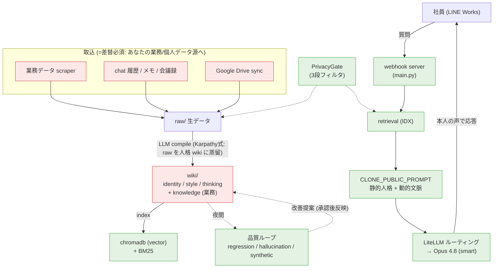

# Personal Brain 移植ガイド (マスター索引)

> 別のエグゼクティブ / 別の会社向けに、この「Personal Brain」(エグゼクティブの AI 分身 + 業務 retrieval + 自己複製基盤) を**ゼロから作り直す**ための入口ドキュメント。
> このシステムの正体・全体像は `docs/review/ARCHITECTURE.md` を先に読むと 30 分で掴める。本ガイドは「移植者が何を・どの順で読み、何を決め、何を作り替えるか」を束ねる。
>
> 対象読者: このリポジトリを土台に、自分たちのエグゼクティブのクローンを立てたい開発者。

---

## 0. このキットの構成 (7 本 + 既存資料)

> 📖 **経営者・他社社長への共有は → [00_CONCEPT_DECK_FOR_CEO.md](00_CONCEPT_DECK_FOR_CEO.md)**(プレゼン形式: コンセプト / 構造 / データセット / 価値 / 作るには何が要るか / 注意点)。
> 🤖 **AI コーディングエージェント(Claude Code / Codex)で作るなら → まず [BUILD_KICKOFF.md](BUILD_KICKOFF.md)** をエージェントに読ませる(フェーズ別ビルド指示 + 完了条件 + ガードレール)。
> 本書 (PORTING_GUIDE) 以降は開発者向けの詳細仕様です。

移植者の旅は **理解 → ゼロ構築 → 自分用に作り替え → 運用** の 4 フェーズ。各フェーズで読むものを下にマップする。`docs/porting/` の 5 本が「移植に特化した橋渡し」、それ以外は既存の濃い資料を再利用する。

| フェーズ | 何をするか | 読むもの (★=本キット新規) |
|---|---|---|
| **① 理解** | システムの正体・思想を掴む | `docs/review/ARCHITECTURE.md` / `docs/glossary.md` / `docs/decisions/` (ADR 25 本、特に self-replication / karpathy / quality-loops) |
| **② ゼロ構築** | 新マシンに素のシステムを立てる | ★`SETUP_FROM_ZERO.md` + `.env.example` |
| **③ 作り替え (本丸)** | 海山/OWNDAYS を「自分の人/会社」に置換 | ★`GENERIC_VS_SPECIFIC.md` (何を残し何を捨てるか) → ★`PERSONA_BOOTSTRAP.md` (新しい人の人格をゼロデータから立てる方法論) |
| **③' プライバシー** | 自組織/管轄に合わせて安全に | ★`PRIVACY_COMPLIANCE.md` |
| **④ 運用** | 日々動かす・直す | `docs/runbook.md` / `docs/failure-log.md` (事故と学びの宝庫) |

> ★本キットの 5 本目がこのファイル (マスター索引)。

---

## 1. 全体アーキテクチャ (1 枚)

- **緑 = 汎用エンジン** (そのまま再利用): retrieval / LiteLLM / プロンプト機構 / 品質ループ / PrivacyGate 枠。
- **赤 = 差し替え必須** (あなたの人/会社の中身に): 取込スクレイパー / 人格 wiki。
- 詳細な「汎用 vs 差替」分類は `GENERIC_VS_SPECIFIC.md`。

---

## 2. Phase 0 — 最初に決めること (ここを曖昧にすると手戻りする)

| 決めること | 影響する場所 |
|---|---|
| **誰のクローンか** + その人の**データ取得の同意/協力**は取れているか | `PERSONA_BOOTSTRAP.md` の Step1 (本人の chat/メモ/判断例が無いと「声」が立たない) |
| **どの業務データを retrieval に載せるか** (売上? 業務KPI? 顧客?) | 取込スクレイパーを全部作り替え (`GENERIC_VS_SPECIFIC.md` §3) |
| **言語** (日本語前提が随所に直書き) | プロンプトの「日本」default scope 等 (`GENERIC_VS_SPECIFIC.md` §5 の grep) |
| **規模** (利用社員数 / トラフィック) | インフラ・コスト・Docker VM RAM (`SETUP_FROM_ZERO.md` §1) |
| **モデル provider** | 既定は Anthropic Opus。ただし **embedding は OpenAI 依存** (swap 不可、`SETUP_FROM_ZERO.md` 参照) |
| **デプロイ環境** (Mac / Linux サーバ) | Docker はどちらも可。Docker Desktop(GUI)依存と VM RAM の罠に注意 (`failure-log.md` 2026-06-15) |
| **プライバシー方針 / 管轄法** | `PRIVACY_COMPLIANCE.md` (除外パターン・同意・法令は自組織で設計必須) |

---

## 3. 推奨ルート

### 最短ルート (まず「動くクローン」を体験する)
1. `SETUP_FROM_ZERO.md` で素のシステムを起動 (中身は空 wiki)
2. `PERSONA_BOOTSTRAP.md` の **最小データセット** (survey 100 問 + chat + 嗜好) だけ入れて compile → 1 人分の人格を立てる
3. LINE Works で 1:1 疎通 → 「声」が出るのを確認

### 本番ルート (実運用に乗せる)
4. `GENERIC_VS_SPECIFIC.md` の grep で 海山/OWNDAYS 直書きを全て自社へ置換
5. 業務データ取込を自社データ源へ (スクレイパー作り替え)
6. `PRIVACY_COMPLIANCE.md` で除外パターン・同意・admin ゲートを自組織設計
7. `PERSONA_BOOTSTRAP.md` の alignment (135問 + response-bank + few-shot) で「声」を本気で固める
8. 品質ループ稼働 + **自分たちの業務トピックの gold 質問を regression に追加** (劣化検知の生命線)
9. `runbook.md` で cron / 監視 / 復旧を運用化

---

## 4. このプロジェクトが踏んだ「高くついた学び」(移植者は先回りで回避)

`docs/failure-log.md` に時系列で全部あるが、移植で特に効くもの:
- **Docker source は image に baked-in** → コード変更後は `build + force-recreate`、restart だけでは古いまま
- **chromadb 並行アクセス禁止** (line-bot 稼働中の reindex で SIGSEGV / index 破損)
- **Docker VM RAM をデフォルト放置しない** (常駐コンテナが肥大 → VM スラッシュ → デーモン wedge → 公開全断。2026-06-15)
- **compile 出力 (identity/style/thinking) を手編集して push しない** (data 外科的分離、`docs/decisions/2026-05-19-data-surgical-separation.md`)
- **通知経路は自分の死を通知できない** → 監視は系外から (2026-06-11 / 06-15)
- **gold 質問の無い人格パスは劣化しても気づけない** (2026-06-15 の「素の AI 声」回帰)
- **prompt cache は hit 率を実測しないと write storm で逆に高くつく** (2026-06-01)

---

## 5. このキットを作る過程で見つかった既存資料の要修正点

移植エージェントが原典照合で発見 (本リポジトリ自身の改善 TODO):
- `docs/mac_studio_setup_2026-05-25.md`: Google 認証は **OAuth refresh-token** (service account でない)。bootstrap は repo 直下 `google_sync.py` + repo 直下 `credentials.json` (memo の `scripts/google_sync.py` / `data/brain/credentials.json` は誤り)
- `.env.example`: コードが読むのに未記載の 6 変数 (`BRAIN_EXTENSION_KEY` / `ALIGNMENT_TRIAL_TOKEN` / `WHITESPACE_TOKEN` / `COHERE_API_KEY` / `LW_BOT_USER_ID` / `LW_BOT_MENTION_NAMES`。`VOICE_ALIGN_TOKEN` は追記済 = .env.example L79)。`OPENAI_API_KEY` は embedding 依存で**実質必須**
- PrivacyGate: **scraper→import 経路は未スクラブ**、Drive fullText は本文 2nd-pass が要る、PII 正規表現は日本語フォーマット限定

→ 移植前にこれらを直すと、移植者がハマらない。

---

## 6. ファイル一覧 (本キット)

| ファイル | 行数 | 役割 |
|---|---|---|
| `00_CONCEPT_DECK_FOR_CEO.md` | — | **経営者向けプレゼン**(Marp): コンセプト/構造/データセット/価値/作るには何が要るか/注意点 |
| `BUILD_KICKOFF.md` | — | **AIエージェント向けビルド指示書**: フェーズ別作業+完了条件+ガードレール (Claude Code/Codex に投入) |
| `PORTING_GUIDE.md` (本書) | — | マスター索引・全体図・最初に決めること |
| `SETUP_FROM_ZERO.md` | ~494 | ゼロ構築 (前提・アカウント・.env・初回起動・落とし穴) |
| `PERSONA_BOOTSTRAP.md` | ~462 | 人格構築方法論 (取込→compile→alignment→品質→記憶) |
| `GENERIC_VS_SPECIFIC.md` | ~272 | 汎用 vs 差替マップ + grep ターゲット |
| `PRIVACY_COMPLIANCE.md` | ~456 | プライバシーゲート・除外・同意・admin・法令 |

Last Updated: 2026-06-16
